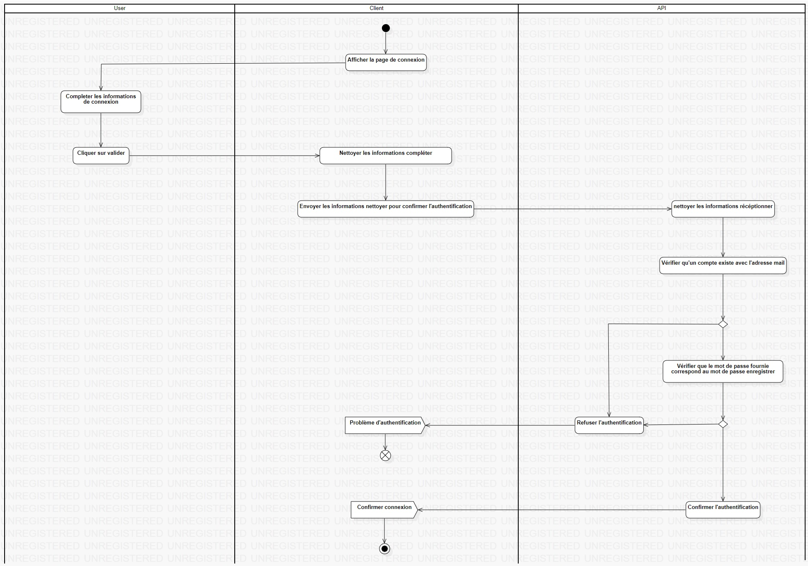

# diagramme d'activité

## Introduction

Un diagramme d'activité est un type de diagramme UML qui représente le flux de contrôle ou de travail dans un système, en montrant les différentes activités ou actions réalisées et l'ordre dans lequel elles sont exécutées. Il est particulièrement utile pour modéliser les processus métiers, les algorithmes, ou tout autre type de workflow

## Diagramme

[Retour au menu](../README.md)