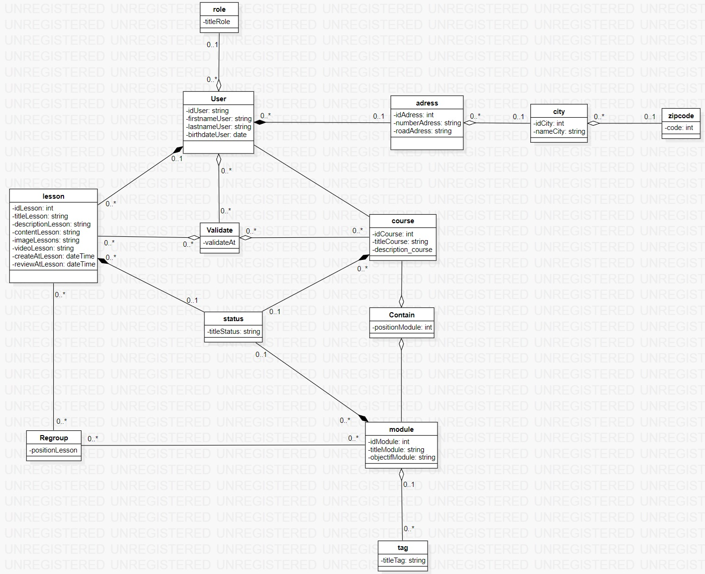

# diagramme de class

## Introduction

Un diagramme de classes est un type de diagramme UML qui représente la structure statique d'un système en montrant les classes du système, leurs attributs, méthodes, et les relations entre elles. Il est utilisé pour modéliser la structure d'un logiciel orienté objet, en se concentrant sur les éléments principaux et leurs interactions.

## Diagramme

[Retour au menu](../README.md)