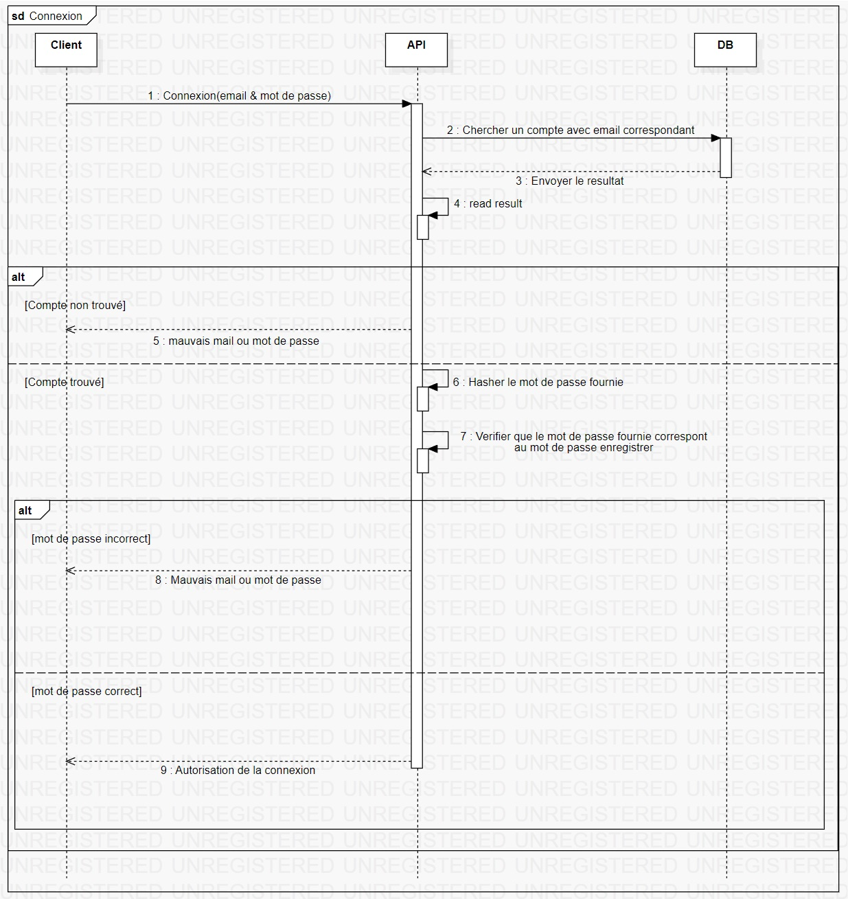
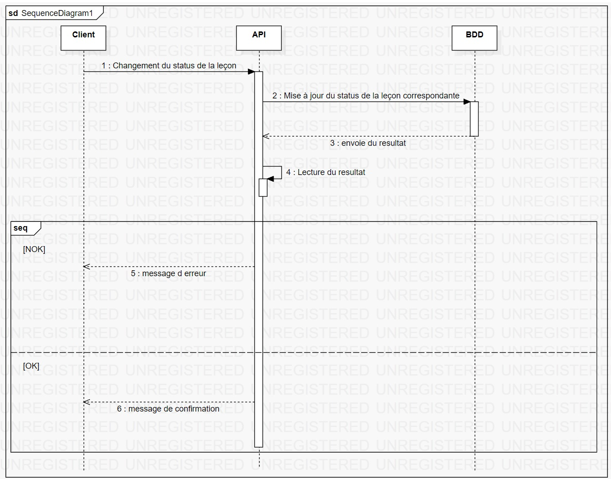

# diagramme d'activité

## Introduction

Un diagramme de séquence est un type de diagramme UML qui représente les interactions entre différents éléments d'un système sous forme de séquences temporelles. Il montre comment les objets et composants du système communiquent entre eux en envoyant des messages dans un ordre spécifique pour accomplir une tâche particulière. Ce type de diagramme est utile pour modéliser le comportement dynamique d'un système.

## Diagramme

### Connexion

### Changer le status d'une leçon

[Retour au menu](../README.md)