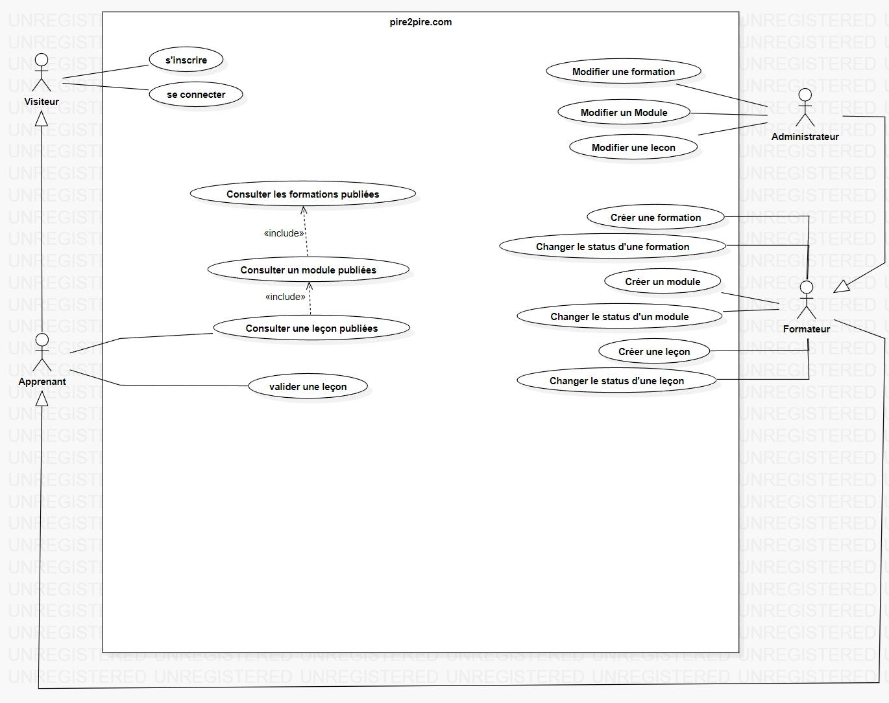

# diagramme de cas d'utilisation

## Introduction

Un diagramme de cas d'utilisation est un type de diagramme UML qui représente les interactions entre les utilisateurs et le système. Il sert à décrire les fonctionnalités ou services que le système offre aux utilisateurs.

## Diagramme

[Retour au menu](../README.md)